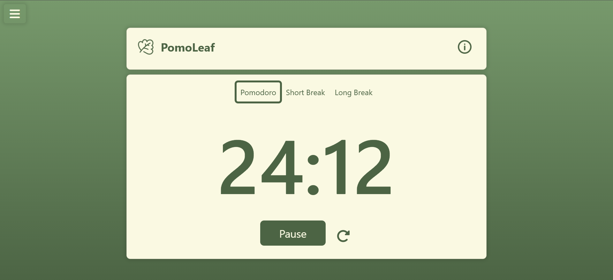
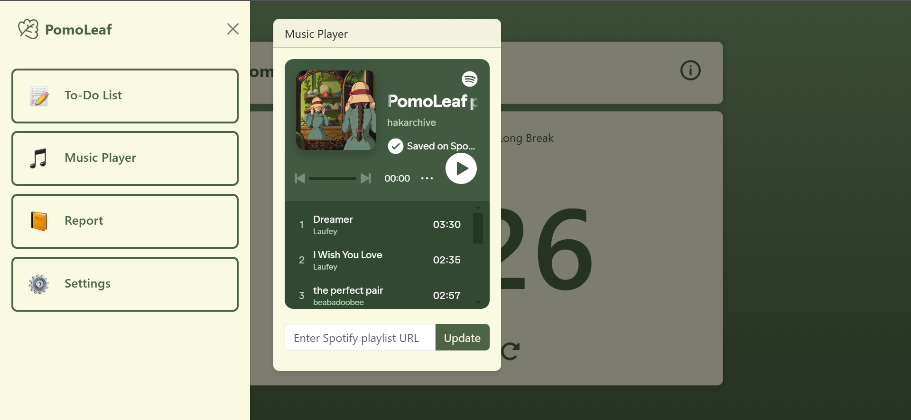

# PomoLeaf 🌿 (Pomodoro Timer)

  
  

## Deskripsi
PomoLeaf merupakan aplikasi produktivitas yang dirancang untuk membantu user mengelola waktu mereka dengan efektif menggunakan Teknik Pomodoro. Teknik Pomodoro berprinsip bahwa istirahat di sela-sela belajar sangat penting untuk menjaga fokus. Pada umumnya, dengan teknik ini kita dapat belajar selama 25 menit dan lima menit istirahat. PomoLeaf meningkatkan teknik ini dengan fitur tambahan yang membuat manajemen waktu menjadi lebih menarik dan efisien.

## Fitur
- **⏰ Timer Pomodoro:** Timer Pomodoro: Timer Pomodoro yang dapat disesuaikan untuk mengatur interval belajar dan istirahat.
- **📝 To-Do List** Pengguna dapat membuat daftar tugas yang perlu diselesaikan, menandai tugas yang sudah selesai, dan menghapus tugas.
- *🎵 Music Player:** Dengarkan musik untuk membantu Anda tetap fokus saat belajar. Pemutar musik ini terintegrasi dengan layanan musik online Spotify.
- **📕 Focus Statistic:** lacak waktu belajar dan tugas-tugas yang telah dikerjakan.
- **⚙️Settings:** atur waktu belajar sesuai keinginan Anda.

## Teknologi
- **Front-End:** HTML, CSS, Javascript, Bootstrap
- **Back-End:** Spotify API

## Cara menggunakan kode
1.	Download source code di github.
2.	Buka source code yang telah di-download di code editor pilihan Anda.
3.	Cari dan buka file index.html.
4.	Jika Anda menggunakan Visual Studio Code (VS Code), Anda dapat menginstal ekstensi Live Server.
5.	Klik kanan pada file index.html yang terbuka di editor.
6.	Pilih "Open with Live Server" dari menu konteks.
7.	Browser default Anda akan terbuka dan menampilkan web pomodoro timer.

